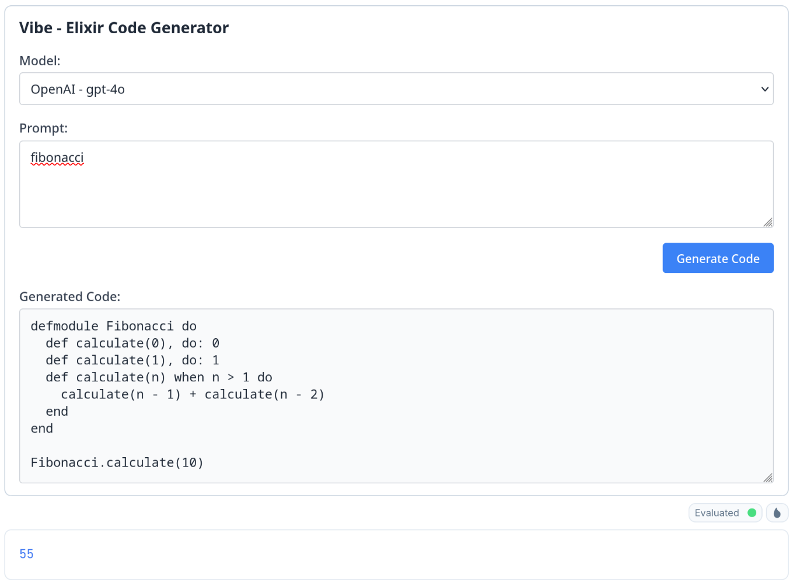
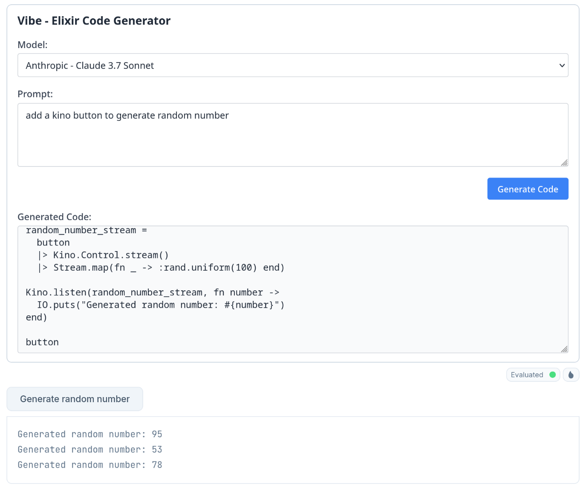
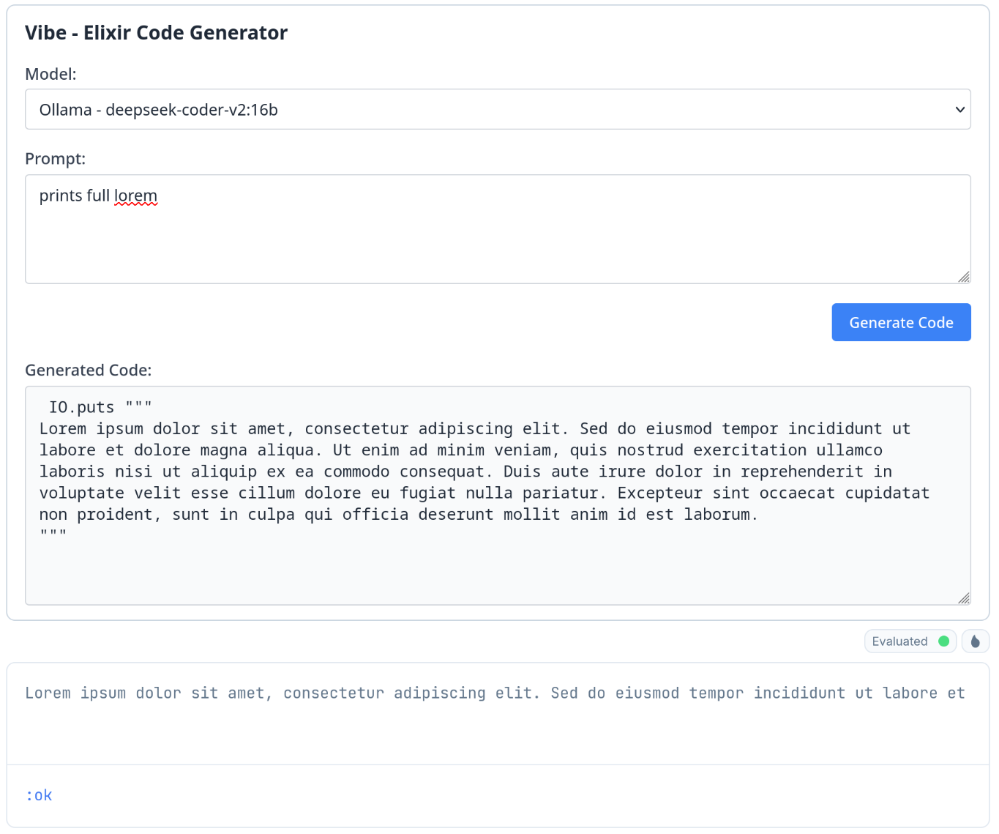
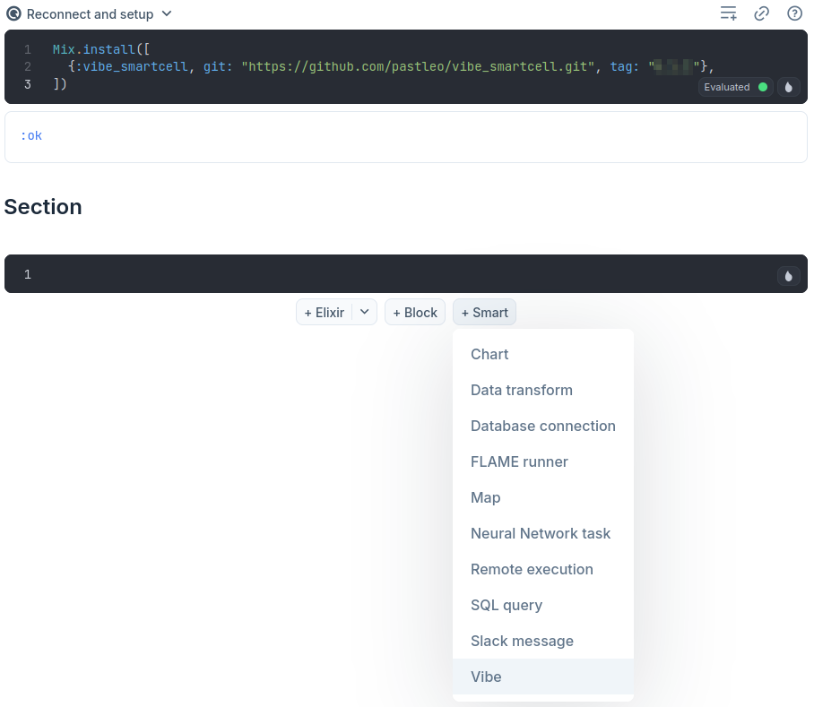
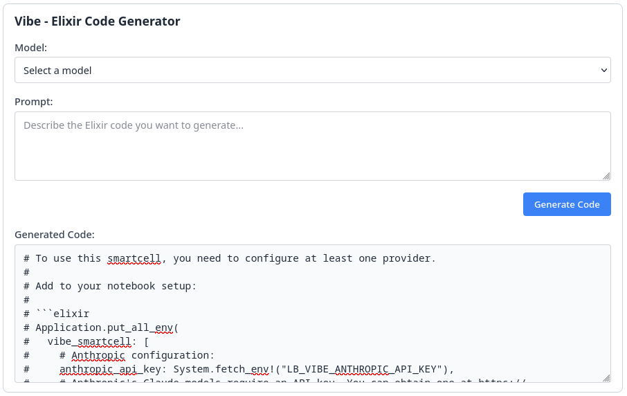

# Vibe Smartcell







## Installation

Add these lines to `Notebook dependencies and setup` to install package and set config

```elixir
Mix.install([
  {:vibe_smartcell, git: "https://github.com/pastleo/vibe_smartcell.git", tag: "0.2.1"},
])
```

Then add `Vibe` smartcell:



When no llm provider is configured, example will be presented by the smartcell:


